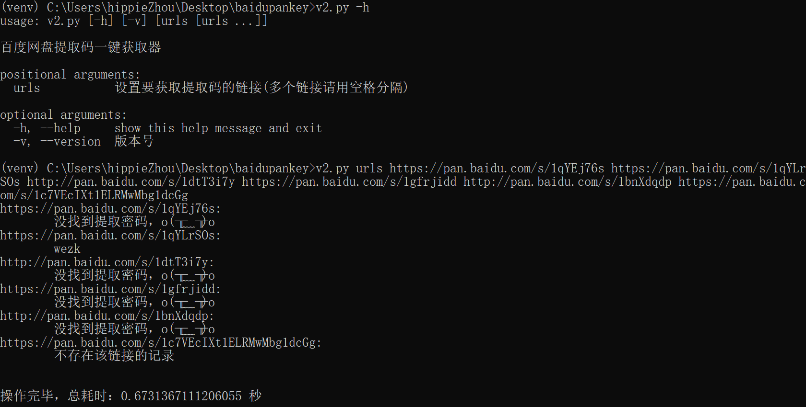

# 百度网盘提取密码一键查询

> 基于云盘万能钥匙 API ，一键查询百度网盘提取密码

## 运行界面

**V1版本**

**V2版本**

> 说明：v1 版本和 v2 版本是通过请求不同的接口方式来实现的， v2 接口的数据要相对更准确一些。具体可查阅具体的代码实现。

## 参数说明

- `-h`：显示当前版本号
- `urls`：待提取的链接

## 相关参考

- [云盘万能钥匙](http://ypsuperkey.meek.com.cn)
- [JS 版](https://github.com/wu-dada/baidupankey)